# RAG vs Enhanced RAG Flow Comparison

This diagram illustrates the difference between traditional RAG (vector search only) and Enhanced RAG (vector search + LLM analysis).

```mermaid
graph TD
    A[User Query: 'How to implement JWT authentication?'] --> B{RAG System Type}
    
    %% Traditional RAG Flow
    B -->|Traditional RAG| C[Generate Query Embedding]
    C --> D[Vector Similarity Search]
    D --> E[Retrieve Top Code Chunks]
    E --> F[Return Raw Results with Scores]
    F --> G[User Interprets Code Manually]
    
    %% Enhanced RAG Flow  
    B -->|Enhanced RAG| H[Generate Query Embedding]
    H --> I[Vector Similarity Search]
    I --> J[Retrieve Top Code Chunks]
    J --> K{LLM Available?}
    
    K -->|No| L[Fallback to Raw Results]
    L --> G
    
    K -->|Yes| M[Build Context from Code]
    M --> N[Create Enhanced Prompt]
    N --> O[Send to LLM]
    O --> P[LLM Analysis & Synthesis]
    P --> Q[Enhanced Response with Explanations]
    
    %% Styling
    classDef userInput fill:#e1f5fe
    classDef traditional fill:#fff3e0
    classDef enhanced fill:#e8f5e8
    classDef llm fill:#f3e5f5
    classDef output fill:#fce4ec
    
    class A userInput
    class C,D,E,F traditional
    class H,I,J,M,N enhanced
    class O,P llm
    class G,Q output

    %% Add detail boxes
    subgraph "Traditional RAG Output"
        TR1["📁 auth/middleware.js (87% match)"]
        TR2["📁 routes/login.js (82% match)"] 
        TR3["📁 utils/jwt.js (78% match)"]
        TR4["Raw code chunks + similarity scores"]
    end
    
    subgraph "Enhanced RAG Output"  
        ER1["🤖 'The JWT authentication flow uses..."]
        ER2["📋 1. Token generation in utils/jwt.js"]
        ER3["📋 2. Middleware validation in auth/middleware.js"]
        ER4["📋 3. Route protection patterns in routes/"]
        ER5["⚠️ Key gotchas: Token expiration handling"]
        ER6["💡 Implementation follows OAuth 2.0 standard"]
    end
    
    F -.-> TR1
    Q -.-> ER1
```

## Key Differences:

### Traditional RAG
- **Input**: User query → Vector embedding
- **Process**: Similarity search in vector database
- **Output**: Raw code chunks ranked by similarity score
- **User Experience**: Must manually interpret and connect code pieces

### Enhanced RAG  
- **Input**: User query → Vector embedding → Code retrieval
- **Process**: Vector search + LLM analysis and synthesis
- **Output**: Structured explanations with context and insights
- **User Experience**: Gets actionable explanations and implementation guidance

## Flow Details:

1. **Query Processing**: Both systems start with embedding the user's natural language query
2. **Vector Search**: Both perform semantic similarity search in the code database  
3. **Key Divergence**: Traditional RAG stops here; Enhanced RAG continues to LLM
4. **LLM Enhancement**: Analyzes retrieved code, explains patterns, identifies gotchas
5. **Output**: Traditional gives raw code; Enhanced gives explanations + code references

## Benefits of Enhanced RAG:

- 🎯 **Contextual Understanding**: Explains HOW code works, not just WHERE it is
- 🔗 **Connection Building**: Links multiple code pieces into coherent explanations  
- 📚 **Pattern Recognition**: Identifies architectural patterns and best practices
- ⚠️ **Risk Awareness**: Points out potential issues and implementation gotchas
- 🚀 **Faster Onboarding**: Helps developers understand unfamiliar codebases quickly